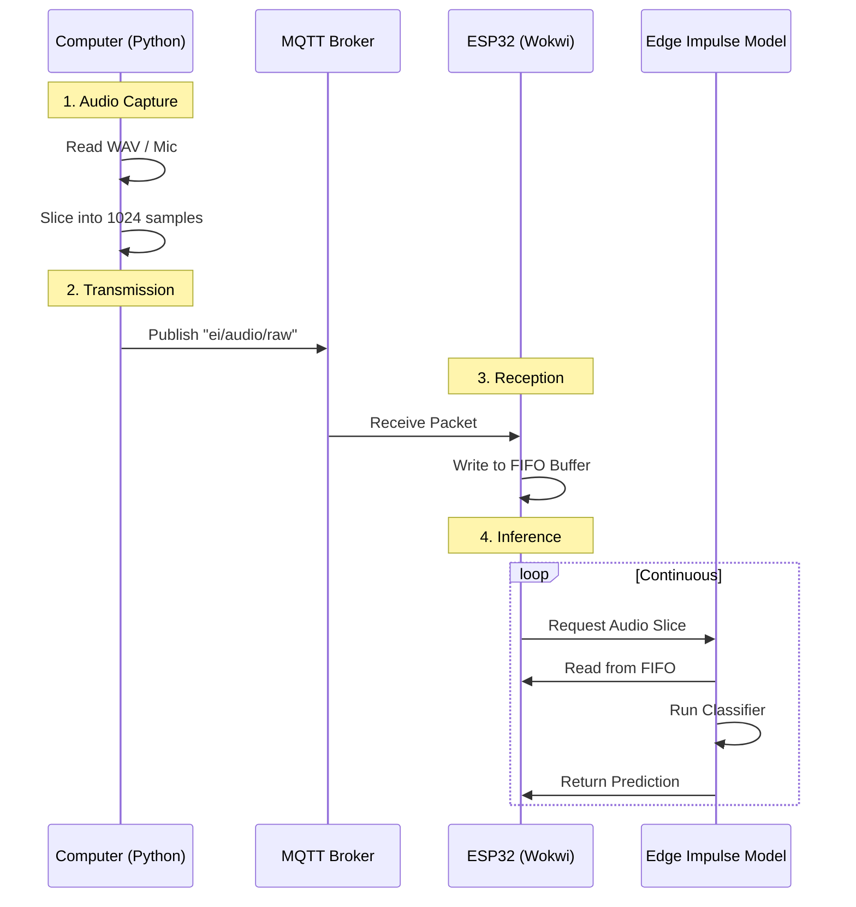

# TP10: Deploying Arabic Keyword Spotting on ESP32-S3

## 1. Introduction

**TP10** is the direct continuation of **[TP9](../TP9/TP9.md)**. In TP9, you successfully:
1.  Collected an Arabic speech dataset ("تمكين", "تعطيل", etc.).
2.  Trained a Keyword Spotting (KWS) model using Edge Impulse.
3.  Exported the trained model as an **Arduino Library**.

**In TP10, you will deploy this model onto the ESP32-S3 microcontroller.**

### The Challenge: Simulation vs. Reality
In a real hardware setup, we would use an **I2S Microphone (INMP441)** connected directly to the ESP32. However, the **Wokwi Simulator** does not currently support I2S microphone simulation.

### The Solution: MQTT Audio Streaming
To overcome this limitation, we will use a **Hybrid Simulation Approach**:
1.  **Audio Source**: Your computer (browser or Python script) acts as the microphone.
2.  **Bridge**: A Python script captures this audio and streams it over **MQTT**.
3.  **Receiver**: The ESP32 in Wokwi receives these audio packets via WiFi/MQTT and feeds them into the Edge Impulse classifier.

---

## 2. Library Installation & Verification

Before writing any code, you must install the library you exported from Edge Impulse in TP9.

### 2.1 Installation Steps
1.  Locate your downloaded `.zip` file from TP9 (e.g., `ei-arabic-kws-arduino.zip`).
2.  Extract the ZIP file.
3.  Copy the extracted folder into the `TP10/lib/` directory.

### 2.2 Verification
Ensure your project structure looks like this:

```
TP10/
├── lib/
│   └── ahmed3991-Keyword-Spotting_inferencing/  <-- Your Library
│       ├── src/
│       ├── examples/
│       └── library.properties
├── src/
│   └── main.cpp
└── ...
```

**Check `src/main.cpp`:**
Open `src/main.cpp` and verify line 5 matches your library's name exactly:

```cpp
// ✅ CORRECT
#include <ahmed3991-Keyword-Spotting_inferencing.h>

// ❌ INCORRECT (Example)
// #include <ei-arabic-kws-enable-disable.h> 
```

> **Note**: The library name is derived from your Edge Impulse project name. Check the `.h` file inside your library's `src/` folder if you are unsure.

---

## 3. System Architecture

The system consists of three main components working in real-time:



---

## 4. Component Explanation

### 4.1 The Audio Dispatcher (Python)
**File**: `mic_mqtt_simulation/websocket_audio_dispatcher.py`

This script is the "Virtual Microphone". It reads audio data and pushes it to the ESP32.

**Key Features:**
1.  **WebSocket Server (`ws://localhost:8765`)**:
    *   Allows a web browser to connect and stream microphone audio directly to this script.
    *   Useful for live testing with your own voice.

2.  **MQTT Client**:
    *   Connects to `broker.mqtt.cool` (or any configured broker).
    *   Topic: `ei/audio/raw`.

3.  **Audio Slicing**:
    *   Edge Impulse models expect audio in specific "slices".
    *   The script buffers incoming audio and cuts it into chunks of **1024 samples** (default).
    *   It converts these samples into raw bytes (Little Endian 16-bit integers) before publishing.

**Why this matters**: The ESP32 is a resource-constrained device. Sending huge audio files at once would crash it. Streaming small slices mimics how a real microphone delivers data.

### 4.2 The Firmware (C++)
**File**: `src/main.cpp`

This is the brain of the operation. It replaces the standard microphone driver with an MQTT client.

#### A. Data Structures
*   **`fifo_buffer_t`**: A **Circular Buffer** (Ring Buffer) used to store incoming audio.
    *   **Why?** Network packets arrive at irregular intervals (jitter). The inference engine needs a steady stream of data. The buffer smooths out these irregularities.
    *   **Size**: `8192` samples (~0.5 seconds). If the buffer fills up, new data is dropped to prevent crashing.

#### B. Setup Phase (`setup()`)
1.  **WiFi & MQTT**: Connects to the Wokwi guest network and the MQTT broker.
2.  **`run_classifier_init()`**: Initializes the Edge Impulse model structures.
3.  **`microphone_inference_start()`**: Allocates memory for the inference buffers.

#### C. The Main Loop (`loop()`)
1.  **`mqttClient.loop()`**: Keeps the MQTT connection alive and processes incoming packets.
2.  **`microphone_inference_record()`**:
    *   This function **blocks** (waits) until enough data is available in the FIFO buffer.
    *   It ensures the classifier doesn't run on empty or incomplete data.
3.  **`run_classifier_continuous()`**:
    *   This is the core Edge Impulse function.
    *   It takes the audio data, runs the DSP (MFCC/MFE), and then the Neural Network.
    *   It returns a `result` object containing the predictions.

#### D. The MQTT Callback (`mqtt_callback`)
*   Triggered whenever a new audio packet arrives.
*   Converts the raw bytes back into `int16_t` audio samples.
*   Writes them into the `audio_fifo`.

---

## 5. How to Run the Project

### Step 1: Build & Simulate Firmware
1.  Open the project in VS Code.
2.  Click the **PlatformIO Build** icon (checkmark).
3.  Start the **Wokwi Simulator** (F1 > "Wokwi: Start Simulator").
4.  Wait until you see:
    ```
    Connecting to MQTT broker...
    Connected!
    Waiting for audio data via MQTT topic: ei/audio/raw
    ```

### Step 2: Stream Audio
You have two options to test the system:

**Option A: Stream a WAV File (Reproducible Test)**
Use this to test specific files from your dataset (e.g., "enable.wav").

```bash
cd TP10/mic_mqtt_simulation
python3 websocket_audio_dispatcher.py --file path/to/enable.wav
```

**Option B: Use Your Microphone (Live Test)**
1.  Run the dispatcher in "server mode":
    ```bash
    cd TP10/mic_mqtt_simulation
    python3 websocket_audio_dispatcher.py
    ```
2.  Open the `web_audio_client.html` (if provided) or a compatible WebSocket test client in your browser.
3.  Connect to `ws://localhost:8765` and speak!

### Step 3: Observe Results
Watch the ESP32 Serial Monitor. You should see predictions appearing in real-time:

```
Predictions:
    enable: 0.98
    disable: 0.01
    unknown: 0.01
    noise: 0.00
```
