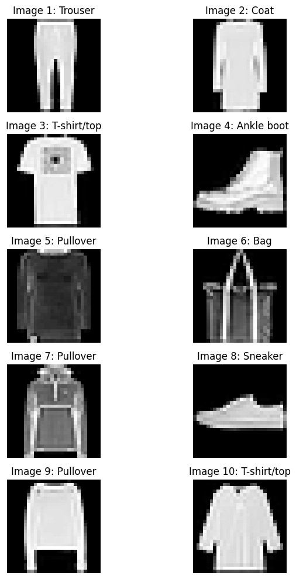

# TP7: Integrating and Predicting with a TensorFlow Lite Model on ESP32-S3

This practical work guides you through the process of converting a TensorFlow Lite model to a C header file, integrating it into an Arduino project for the ESP32-S3, and performing inference to classify images.

## 1. Converting your TensorFlow Lite Model to a C Header File using `xxd`

To embed your `.tflite` model directly into your C/C++ code, you need to convert it into a C header file. This process essentially transforms the binary model data into a C-style byte array. We use the `xxd` command-line tool for this.

**Step 1: Obtain your `.tflite` model**
Ensure you have your trained TensorFlow Lite model saved as a `.tflite` file (e.g., `fashion_mnist_cnn_int8.tflite`). This file should be placed in a location accessible from your terminal. For this TP, we assume you have already converted your model to `int8` quantization.

**Step 2: Use `xxd` to convert the `.tflite` file**
Open your terminal and navigate to the directory where your `.tflite` model is located. Then, execute the following command:

```bash
xxd -i your_model_name.tflite > model_data.h
```

Let's break down this command:
- `xxd`: The command-line utility for creating a hex dump of a given file or standard input.
- `-i`: This option tells `xxd` to output the data in a C include file style. It will generate a `uint8_t` array definition.
- `fashion_mnist_cnn_int8.tflite`: This is the input file, your TensorFlow Lite model.
- `> src/model_data.h`: This redirects the output of the `xxd` command to a new file named `model_data.h` inside the `src` directory. This will be your model header file.

After running this command, a new file `src/model_data.h` will be created, containing a `uint8_t` array that represents your `.tflite` model.

## 2. Integrating the Model into Your Code

Now that you have your model as a C header file, you need to include it in your Arduino project and make it accessible to the TensorFlow Lite Micro interpreter.

### `src/model_data.h`

The `xxd` command generates a file like this (content will vary based on your model):

```c++
unsigned char fashion_mnist_cnn_int8_tflite[] = {
  0x18, 0x00, 0x00, 0x00, 0x54, 0x46, 0x4c, 0x33, 0x00, 0x00, 0x00, 0x00,
  // ... more hex data ...
};
unsigned int fashion_mnist_cnn_int8_tflite_len = 12345; // Actual length will vary
```

You will include this file in your `main.cpp`.

### `src/main.cpp` modifications

You will need to make several modifications to `src/main.cpp` to properly integrate and use your model.

#### a. Include the model header

First, ensure that `src/main.cpp` includes your generated `model_data.h` file. This is already present as a TODO in the provided code:

```cpp
#include "model_data.h" // TODO: implemet your model file
```

**Explanation:** This line makes the `fashion_mnist_cnn_int8_tflite` byte array (which holds your model data) available in your `main.cpp` file.

#### b. Define Tensor Arena Size and Array

The TensorFlow Lite Micro interpreter requires a contiguous block of memory, known as the "tensor arena," for its operations. You need to define its size and declare the array.

**TODO:** Define the `TENSOR_ARENA_SIZE` and declare the `tensor_arena` array.

```cpp
#define TENSOR_ARENA_SIZE 93 * 1024
uint8_t tensor_arena[TENSOR_ARENA_SIZE];
```

**Explanation:**
- `#define TENSOR_ARENA_SIZE 93 * 1024`: This defines the size of the tensor arena in bytes. The required size depends on your model's complexity. If this size is too small, tensor allocation will fail. You might need to adjust this value based on your model's memory footprint.
- `uint8_t tensor_arena[TENSOR_ARENA_SIZE];`: This declares a byte array of the specified size, which will be used by the interpreter for all tensor allocations.


#### c. Initialize the TFLite MicroInterpreter

The interpreter is the core component that runs your model. You need to instantiate it with your model, an `AllOpsResolver` (which provides all necessary TensorFlow Lite Micro operations), the tensor arena, and its size.

**TODO:** Initialize the TFLite MicroInterpreter.

```cpp
    interpreter = new tflite::MicroInterpreter(model, resolver, tensor_arena, TENSOR_ARENA_SIZE);
```


**Explanation:**
- `model`: A pointer to your loaded TensorFlow Lite model (e.g., `fashion_mnist_cnn_int8_tflite`).
- `resolver`: An instance of `tflite::AllOpsResolver` that provides the necessary operations for your model.
- `tensor_arena`: The memory buffer allocated for tensors.
- `TENSOR_ARENA_SIZE`: The size of the tensor arena.


## 3. Performing Prediction with the Model

Once the model is loaded and the interpreter is initialized, you can feed input data to it and run inference to get predictions.

### Mock Camera Input

For this TP, we are simulating camera input using pre-defined images from the Fashion MNIST dataset. These images are stored in `image_list.h` and `image_data.h`.

Here are some examples of the images we are using from the Fashion MNIST dataset:



These images are 28x28 grayscale images, normalized and converted to `int8_t` format, suitable for direct input to our quantized model. The `setup()` function randomly selects one of these images to simulate a camera capture.

#### a. Copy Image Data into Input Tensor

Before running inference, you need to copy your input image data into the model's input tensor.

**TODO:** Copy the converted image data into the input tensor.

```cpp
    memcpy(input->data.int8, model_input_data, MODEL_INPUT_SIZE);
```

**Explanation:**
- `input->data.int8`: This is a pointer to the memory location of the input tensor, where your image data should be placed. Since our model expects `int8_t` input, we access `data.int8`.
- `model_input_data`: This is the pointer to your prepared image data (in `int8_t` format).
- `MODEL_INPUT_SIZE`: The total number of bytes in the input image (width * height).


#### b. Invoke the Interpreter

After providing the input, you invoke the interpreter to run the inference.

**TODO:** Invoke the interpreter to run inference.

```cpp
    if (interpreter->Invoke() != kTfLiteOk)
        {
            takeNewPicture = true;
            lcd.setCursor(0, 1);
            lcd.print("Failed Inferece");
            lcd.print("    "); // clear any leftover characters
            Serial.println("❌ Inference failed!");
            while (1)
                ;
        }
```

**Explanation:**
- `interpreter->Invoke()`: This function executes the TensorFlow Lite model with the current input data.
- `kTfLiteOk`: This is the expected return status if the inference runs successfully. If it returns anything else, an error occurred.


#### c. Process and Print Prediction Results

Finally, you retrieve the output from the model's output tensor, find the class with the highest probability, and print the predicted class name. For verification, we also print the true class name from our `label_list`.

**TODO:** Print the predicted class index and name, and compare with the true class.

```cpp
    Serial.print("Predicted class index: ");
        Serial.println(max_idx);
        Serial.print("Predicted class name: ");
        Serial.println(class_names[max_idx]);

        Serial.print("True class index: ");
        Serial.println(label_list[image_index - 1]);
        Serial.print("True class name: ");
        Serial.println(class_names[label_list[image_index - 1]]);
        // Update LCD with predicted class
        lcd.setCursor(0, 1);
        lcd.print("Class:");
        lcd.print(class_names[max_idx]);
        lcd.print("   "); // clear any leftover characters
```

**Explanation:**
- `max_idx`: This variable holds the index of the class with the highest confidence score from the model's output.
- `class_names[max_idx]`: This uses the `max_idx` to look up the human-readable name of the predicted class from the `class_names` array.
- `label_list[image_index - 1]`: This retrieves the true class label for the selected mock image from the `label_list` array.


By following these steps, you will successfully integrate your TensorFlow Lite model into your ESP32-S3 project and perform image classification!
