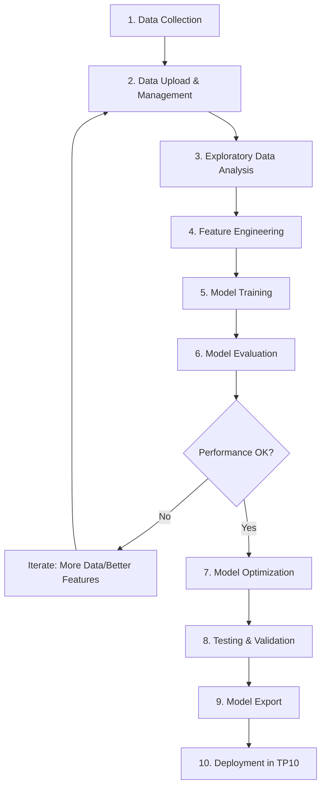

# TP9: Introduction to Edge Impulse MLOps Platform - Building Arabic Keyword Spotting Model

This practical work introduces **Edge Impulse** as a comprehensive **MLOps platform** for Edge AI and TinyML development. You will learn the complete machine learning workflow from data collection to model preparation, building an **Arabic Keyword Spotting (KWS)** system that will be deployed on the **ESP32-S3 microcontroller** in TP10.

---

## 1. Overview

### What is Edge Impulse?

**Edge Impulse** is an end-to-end MLOps (Machine Learning Operations) platform specifically designed for **Edge AI and TinyML**. It provides:

- 🔄 **Complete ML Pipeline**: Data collection → Feature engineering → Training → Testing → Deployment
- 🎯 **No-Code/Low-Code Interface**: Build production-ready ML models without deep ML expertise
- 🚀 **Automated Optimization**: Automatic model quantization and hardware-specific optimization
- 📊 **Integrated Data Management**: Built-in tools for data collection, labeling, and versioning
- 🔧 **Multi-Platform Deployment**: Export models for various microcontrollers and edge devices
- 📈 **Performance Monitoring**: Track model performance and data quality

### What is an MLOps Platform?

**MLOps** (Machine Learning Operations) combines Machine Learning, DevOps, and Data Engineering to:

- **Automate** the ML lifecycle
- **Standardize** workflows and best practices
- **Monitor** model performance in production
- **Version** datasets and models
- **Collaborate** across teams
- **Deploy** models reliably at scale

Edge Impulse brings MLOps principles to **embedded systems and IoT devices**, making it possible to develop sophisticated AI models for resource-constrained hardware.

### Why Use Edge Impulse for TinyML?

| Traditional ML Tools | Edge Impulse |
|---------------------|--------------|
| Manual feature engineering | Automated DSP blocks (MFCC, MFE, Spectral Analysis) |
| Complex deployment process | One-click export to 15+ platforms (Arduino, ESP32, etc.) |
| Manual quantization tuning | Automatic INT8/INT16 quantization |
| Separate tools for each step | Integrated pipeline from data to deployment |
| Difficult hardware optimization | Hardware-aware neural architecture search |
| Manual data collection | Built-in smartphone/web data collection |

### What is Keyword Spotting (KWS)?

**Keyword Spotting** is the foundation of modern voice assistants like Google Assistant and Amazon Alexa. These devices use a **two-stage cascade detection** system:

- **Stage 1 (Edge/TinyML)**: A small, low-power microcontroller continuously listens for specific wake words (e.g., "Hey Google", "Alexa") using an on-device TinyML model.
- **Stage 2 (Cloud)**: Only when the wake word is detected does the device send audio to the cloud for complex natural language processing.

In this TP, you'll build **Stage 1** using Edge Impulse - an edge-based KWS model that will run on the ESP32-S3 in TP10.

### Arabic Commands for This Project

This practical work uses the **Arabic Speech Commands Dataset** to make the system more relevant to local applications. You'll train a model to recognize:

- **"تمكين"** (Tamekin) - Enable
- **"تعطيل"** (Ta‛teel) - Disable  
- **NOISE** - Background noise only
- **UNKNOWN** - Other Arabic words (not the target commands)

---

## 2. Learning Objectives

By completing this practical work, you will:

1. ✅ **Understand MLOps Concepts** - Learn the complete ML lifecycle and MLOps principles
2. ✅ **Master Edge Impulse Platform** - Navigate the full workflow from data to model export
3. ✅ **Collect and Manage Audio Data** - Use Edge Impulse's data collection tools
4. ✅ **Understand Audio Signal Processing** - Work with MFCC/MFE feature extraction
5. ✅ **Train CNNs for Audio Classification** - Build and optimize deep learning models
6. ✅ **Apply Model Optimization** - Use quantization and compression for edge devices
7. ✅ **Evaluate Model Performance** - Analyze accuracy, confusion matrices, and inference time
8. ✅ **Prepare Models for Deployment** - Export optimized models for ESP32-S3

---

## 3. The MLOps Workflow in Edge Impulse

This project follows the complete MLOps workflow:



---

## 4. Hardware and Software Requirements

### Software and Platforms
- **[Edge Impulse Studio](https://www.edgeimpulse.com/)** (free account required) - Main MLOps platform
- **Smartphone** or **Computer with microphone** (for data collection)
- **Web Browser** (Chrome, Firefox, or Edge)

### Dataset
- **[Arabic Speech Commands Dataset](https://www.kaggle.com/datasets/abdulkaderghandoura/arabic-speech-commands-dataset)** (Kaggle)
- You will also collect your own samples using Edge Impulse's data collection tools

### Future Deployment (TP10)
- **XIAO ESP32S3** microcontroller
- **Wokwi Microphone** (simulated) or real I2S microphone
- **PlatformIO** or **Arduino IDE**

---

## 5. Part 1: Understanding Edge Impulse MLOps Platform

### 5.1: Create Your Edge Impulse Account

1. **Go to Edge Impulse**:
   - Visit [https://www.edgeimpulse.com/](https://www.edgeimpulse.com/)
   - Click "Sign Up" (free account)
   - Use your university email or personal email

2. **Explore the Platform**:
   - Dashboard: Project overview and quick stats
   - Data acquisition: Collect and manage datasets
   - Impulse design: Configure ML pipeline
   - Deployment: Export models for various platforms

### 5.2: Create Your First Project

1. **Create New Project**:
   - Click "Create new project"
   - **Project name**: `Arabic_KWS_Enable_Disable`
   - **Project type**: Select "Audio"
   - **Labeling method**: "One label per data item"

2. **Review Project Dashboard**:
   - **Data summary**: Number of samples, training/test split
   - **Model performance**: Accuracy, loss graphs (after training)
   - **Deployment targets**: Available export options
   - **Versioning**: Automatic versioning of impulse configurations

> **📝 MLOps Concept - Project Versioning**: Edge Impulse automatically versions your impulse configurations, allowing you to track changes and rollback if needed.

---

## 6. Part 2: Data Collection and Management (MLOps Step 1-3)

### 6.1: Understanding Audio Data Requirements

For keyword spotting to work effectively, we need:

- **Sample Rate**: 16 kHz (standard for speech recognition)
- **Bit Depth**: 16-bit (audio quality)
- **Duration**: 1-second clips per sample
- **Format**: WAV files (uncompressed audio)

### 6.2: Download the Arabic Speech Commands Dataset

1. **Navigate to Kaggle**:  
   Go to [Arabic Speech Commands Dataset](https://www.kaggle.com/datasets/abdulkaderghandoura/arabic-speech-commands-dataset)

2. **Download the dataset**:
   - Click "Download" to get the ZIP file
   - Extract the dataset on your computer

3. **Locate your target classes**:
   The dataset contains multiple Arabic commands. For this TP, you need:
   - **تمكين** (Tame‛ein) - Enable command
   - **تعطيل** (Ta‛teel) - Disable command
   - Select **3-4 other Arabic words** for the "UNKNOWN" class (e.g., نعم, لا, توقف, إبدأ)

4. **Organize your dataset**:
   Create a folder structure:
   ```
   arabic_kws_dataset/
   ├── enable/          # تمكين samples
   ├── disable/         # تعطيل samples  
   ├── noise/           # Background noise (record or find online)
   └── unknown/         # Other Arabic words
   ```

### 6.3: Data Collection with Edge Impulse Tools

Edge Impulse provides multiple data collection methods:

#### Method 1: Smartphone Data Collection

1. **In your Edge Impulse project**:
   - Go to **Data Acquisition**
   - Click **"Use your mobile phone"**
   - Scan the QR code with your phone
   - Grant microphone permissions

2. **Record training samples**:
   - **Label**: `enable`
   - **Sample length**: 1000 ms (1 second)
   - Record yourself saying "تمكين" clearly **20-30 times**
   - Try different:
     - Speaking speeds
     - Distances from microphone
     - Background noise levels

3. **Repeat for other classes**:
   - **Label**: `disable` - Record "تعطيل" **20-30 times**
   - **Label**: `unknown` - Say other Arabic words (15-20 samples total)
   - **Label**: `noise` - Record **10-15 samples** of:
     - Office/room ambient noise
     - Fan noise
     - Street sounds
     - Silence

> **📝 MLOps Concept - Data Diversity**: Always collect diverse data (different speakers, environments, conditions) to improve model generalization.

#### Method 2: Upload Existing Audio Files

1. In Edge Impulse Studio, go to **Data Acquisition**
2. Click **📁 "Upload existing data"**
3. Select files from your organized Kaggle dataset folders:
   - Choose `enable/*.wav` files
   - **Category**: Training data
   - **Label**: `enable`
   - Click "Upload"

4. Repeat for all classes: `disable`, `unknown`, `noise`

### 6.4: Data Management and Quality Control

**Edge Impulse provides automated data management**:

1. **Review Data Quality**:
   - Go to **Data Acquisition**
   - Click on individual samples to:
     - Play audio
     - View waveform
     - Check duration and label
     - Delete poor quality samples

2. **Train/Test Split** (MLOps Best Practice):
   - Go to **Dashboard**
   - Scroll to **Danger Zone**
   - Click **"Perform train/test split"**
   - Recommended: 80% training, 20% testing

3. **Data Balance Check**:
   - Ensure each class has similar number of samples
   - Imbalanced data can bias the model
   - Target: At least 50 samples per class

> **💡 Tip**: For longer audio files (>1 second), use Edge Impulse's **Split sample** tool: click the three dots (⋯) next to the sample → Split sample → divide into 1-second segments.

> **📝 MLOps Concept - Data Versioning**: Edge Impulse automatically versions your dataset. You can see upload history and track data changes over time.

---

## 7. Part 3: Feature Engineering (MLOps Step 4)

### 7.1: Create Your Impulse

An **"Impulse"** in Edge Impulse defines your complete ML pipeline - from raw data to predictions.

1. **Go to Impulse Design → Create Impulse**

2. **Configure Input Parameters**:
   - **Window size**: 1000 ms (1 second of audio)
   - **Window increase**: 500 ms (50% overlap for data augmentation)
   - **Frequency**: 16000 Hz (sample rate)

> **📝 MLOps Concept - Pipeline Configuration**: The impulse is your ML pipeline configuration that can be versioned and reproduced.

### 7.2: Choose Processing Block (Feature Extraction)

Edge Impulse offers two audio processing blocks:

#### Option A: MFCC (Mel-Frequency Cepstral Coefficients) - Recommended for Voice

**Best for**: Human voice recognition, speech processing

1. Click **"Add a processing block"**
2. Select **"Audio (MFCC)"**

**Why MFCC?**
- Mimics human auditory perception
- Captures vocal tract characteristics
- Proven for speech recognition
- More robust to noise

#### Option B: MFE (Mel-Filterbank Energy)

**Best for**: Simpler processing, faster inference, environmental sounds

1. Click **"Add a processing block"**
2. Select **"Audio (MFE)"**

**Why MFE?**
- Simpler computation (no cepstral analysis)
- Lower memory footprint
- Faster inference
- Good for non-speech audio

> **💡 Student Choice**: Try MFCC first for voice recognition. If inference is too slow on ESP32, switch to MFE.

### 7.3: Add Learning Block

1. **Click "Add a learning block"**
2. **Choose one of**:
   
   **Option A: Classification (Keras)** - Train custom CNN from scratch
   - Full control over architecture
   - Better for learning ML concepts
   - Requires more data
   
   **Option B: Transfer Learning (Audio)** - Use pretrained model
   - Faster training
   - Higher accuracy with less data
   - Optimized architecture
   - **Recommended for production**

3. **Click "Save Impulse"**

> **📝 MLOps Concept - Modular Pipelines**: Edge Impulse uses composable processing and learning blocks, making it easy to experiment with different configurations.

---

## 8. Part 4: Configure Feature Extraction

### 8.1: MFCC Configuration

1. **Go to Impulse Design → MFCC**

2. **Choose configuration method**:

#### Method 1: AutoTune (Recommended)
   - Click **"Autotune parameters"**
   - Edge Impulse optimizes for:
     - ESP32-S3 memory constraints
     - Inference speed
     - Classification accuracy
   - Balances performance vs. resource usage

#### Method 2: Manual Configuration
   - **Frame length**: 0.02 seconds (20ms)
   - **Frame stride**: 0.01 seconds (10ms overlap)
   - **FFT length**: 512 (frequency resolution)
   - **Number of coefficients**: 13 (standard for speech)
   - **Low frequency**: 300 Hz (cut off low rumble)
   - **High frequency**: 8000 Hz (human voice range)

3. **Click "Save parameters"**

### 8.2: Generate Features

1. **Click "Generate features"**
2. Wait for processing (1-2 minutes)
3. **Review the Feature Explorer** (MLOps - Exploratory Data Analysis):
   - Interactive 3D visualization of feature space
   - You should see **4 distinct clusters** (enable, disable, unknown, noise)
   - If classes overlap significantly → need more diverse data
   - Look for:
     - ✅ Clear separation between classes
     - ✅ Tight clusters within each class
     - ❌ Scattered points → poor data quality
     - ❌ Overlapping clusters → similar-sounding words

> **📝 MLOps Concept - Feature Engineering**: Automated feature extraction (MFCC/MFE) is a key advantage of Edge Impulse, eliminating manual DSP work.

---

## 9. Part 5: Model Training (MLOps Step 5)

### 9.1: Choose Your Training Approach

#### Approach A: Custom Neural Network (CNN from Scratch)

**Best for**: Learning, full control, understanding architectures

1. **Go to Impulse Design → Classifier**

2. **Review default architecture**:
   ```
   Input Layer (MFCC features: 13 x 49 x 1)
   ↓
   Conv1D (8 filters, kernel=3, ReLU)
   MaxPooling1D (pool_size=2)
   Dropout (0.25)
   ↓
   Conv1D (16 filters, kernel=3, ReLU)
   MaxPooling1D (pool_size=2)
   Dropout (0.25)
   ↓
   Flatten
   ↓
   Dense (64 neurons, ReLU)
   Dropout (0.25)
   ↓
   Output Dense (4 neurons, Softmax)
   ```

3. **Set training parameters**:
   - **Number of training cycles (epochs)**: 100
   - **Learning rate**: 0.005
   - **Validation set size**: 20%
   - **Auto-balance dataset**: Enable
   - **Data augmentation**: Enable
     - Adds noise masking
     - Time shifting
     - Pitch shifting

4. **Click "Start training"**

#### Approach B: Transfer Learning (Pretrained Model)

**Best for**: Production, limited data, higher accuracy, faster training

1. **Go to Impulse Design → Classifier**

2. **Select**: "Transfer Learning (Audio)" or "Transfer Learning (Keyword Spotting)"

3. **Configure transfer learning**:
   - **Base model**: Pretrained on similar audio tasks
   - **Fine-tuning**: Enable (adapts to Arabic commands)
   - **Number of epochs**: 30-50 (fewer than training from scratch)
   - **Learning rate**: 0.0005 (lower for fine-tuning)
   - **Data augmentation**: Enable

4. **Click "Start training"**

> **📝 MLOps Concept - Transfer Learning**: Reusing pretrained models is a standard MLOps practice that reduces training time and improves performance with limited data.

### 9.2: Monitor Training (MLOps - Experiment Tracking)

Edge Impulse provides real-time training monitoring:

1. **Watch training progress**:
   - Loss graph (should decrease)
   - Accuracy graph (should increase)
   - Real-time console output

2. **Review results after training**:
   - **Training accuracy**: Model performance on training data
   - **Validation accuracy**: Performance on held-out validation set (more important!)
   - **Confusion Matrix**: Shows where model makes mistakes
   
3. **Analyze Confusion Matrix**:
   ```
              Predicted
              enable  disable  unknown  noise
   Actual   
   enable      95%      2%       2%      1%      ← Good!
   disable      3%     92%       3%      2%      ← Good!
   unknown      5%      4%      88%      3%      ← Acceptable
   noise        1%      1%       1%     97%      ← Excellent!
   ```
   
   - **Diagonal values**: Correct predictions (should be high)
   - **Off-diagonal values**: Misclassifications (should be low)
   - Common issue: Confusing "enable" with "unknown" → need more diverse "unknown" samples

4. **Target Metrics**:
   - ✅ Validation accuracy >85%: Good performance
   - ⚠️ Validation accuracy 70-85%: Acceptable, needs improvement
   - ❌ Validation accuracy <70%: Poor, need more data or better features

> **🔧 If accuracy is low (<80%)**:
> - Add more diverse training data
> - Increase epochs to 150
> - Try different augmentation settings
> - Switch between MFCC/MFE
> - Try transfer learning instead of custom CNN

### 9.3: Model Architecture Analysis

**Review model complexity**:
- **Total parameters**: Number of trainable weights
- **Flash usage**: Memory on microcontroller
- **RAM usage**: Runtime memory
- **Inference time**: Time to make a prediction

Example output:
```
Model size: 24.2 KB (Flash)
RAM usage: 18.5 KB
Inference time: 213 ms (ESP32-S3)
```

> **📝 MLOps Concept**: Edge Impulse automatically calculates resource usage for your target hardware (ESP32-S3), crucial for embedded deployment.

---

## 10. Part 6: Model Evaluation (MLOps Step 6)

### 10.1: Test with Validation Dataset

1. **Go to Model Testing**
2. **Click "Classify all"**
3. **Review test results**:
   - Overall test accuracy
   - Per-class precision, recall, F1-score
   - Misclassified samples

4. **Investigate misclassifications**:
   - Click on incorrectly classified samples
   - Listen to audio
   - Understand why model failed:
     - Poor audio quality?
     - Too similar to another class?
     - Background noise?
     - Speaker accent variation?

> **📝 MLOps Concept - Test Set Validation**: Always evaluate on a separate test set that the model has never seen during training.

### 10.2: Live Classification Testing

1. **Go to Live Classification**
2. **Connect your smartphone** (scan QR code)
3. **Test in real-time**:
   - Say "تمكين" → Should predict **enable** with >70% confidence
   - Say "تعطيل" → Should predict **disable** with >70% confidence
   - Say other words → Should predict **unknown**
   - Stay silent → Should predict **noise**

4. **Record results**:
   - Accuracy in quiet environment
   - Accuracy with background noise
   - Inference time
   - Confidence scores

> **💡 Test Edge Cases**:
> - Whispered commands
> - Shouted commands
> - Commands with music playing
> - Different speaker genders/ages

### 10.3: Performance Metrics Summary

Create a summary table:

| Metric | Target | Your Result |
|--------|--------|-------------|
| Validation Accuracy | >85% | _____% |
| Test Accuracy | >80% | _____% |
| Inference Time (ESP32-S3) | <500ms | _____ms |
| Model Size (Flash) | <100 KB | _____KB |
| RAM Usage | <50 KB | _____KB |
| Live Test Accuracy | >75% | _____% |

---

## 11. Part 7: Model Optimization (MLOps Step 7)

### 11.1: Quantization for Edge Devices

**Quantization** reduces model size and inference time by converting from 32-bit floats to 8-bit integers.

**Edge Impulse supports**:
- **Float32**: Original precision, largest size
- **Int8**: 4x smaller, 2-4x faster, minimal accuracy loss (Recommended)
- **Int16**: Middle ground

**Edge Impulse automatically applies quantization during deployment!**

### 11.2: Model Optimization Comparison

You can compare different optimizations:

1. **Go to Deployment**
2. **Select "Arduino library"** (we'll export in next step)
3. **View different quantization options**:

| Quantization | Model Size | Inference Time | Accuracy Drop |
|--------------|------------|----------------|---------------|
| Float32 | 96 KB | ~400ms | Baseline |
| Int8 | 24 KB | ~213ms | -2% typical |
| Int16 | 48 KB | ~280ms | -1% typical |

> **📝 MLOps Concept - Model Optimization**: Edge Impulse automates post-training quantization, a crucial step for embedded deployment.

---

## 12. Part 8: Preparing Model for Deployment (MLOps Step 8-9)

### 12.1: Export Model for ESP32-S3

1. **Go to Deployment**

2. **Select deployment target**:
   - Scroll and find **"Arduino library"**
   - This works for ESP32, Arduino, and other microcontrollers

3. **Select optimization**:
   - ✅ **Quantized (int8)** - Recommended
   - Reduces model size by ~75%
   - Minimal accuracy impact
   - Faster inference

4. **Configure export options**:
   - Enable EON Compiler (hardware acceleration)
   - Select target frequency: 240 MHz (ESP32-S3)

5. **Click "Build"**

6. **Download the library**:
   - File name: `ei-arabic-kws-enable-disable-arduino-1.0.0.zip`
   - **Save this file for TP10!**

> **📝 Important**: Keep this `.zip` file - you'll need it in TP10 for deployment on ESP32-S3!

### 12.2: Understanding the Exported Library

The Arduino library contains:

```
ei-arabic-kws-enable-disable/
├── src/
│   ├── model-parameters/          # Model architecture
│   ├── tflite-model/               # TensorFlow Lite model (INT8)
│   ├── edge-impulse-sdk/           # Inference runtime
│   └── *.h                         # Header files
├── examples/
│   ├── static_buffer/              # Example for static inference
│   └── continuous/                 # Example for continuous listening
├── library.properties              # Arduino library metadata
└── README.md                       # Integration instructions
```

**Key files you'll use in TP10**:
- `[project_name]_inferencing.h` - Main header file to include
- `tflite-model/trained_model_compiled.cpp` - Quantized model weights
- `edge-impulse-sdk/` - Inference engine

### 12.3: Model Deployment Preview

**In TP10, you will**:
1. Install this library in PlatformIO/Arduino IDE
2. Write ESP32-S3 firmware to:
   - Capture audio from microphone
   - Run inference using the exported model
   - Control LED/LCD based on predictions
3. Test on real hardware or Wokwi simulator

---

## 13. Part 9: Documentation and Analysis

### 13.1: Create Your Project Report

Document your complete MLOps workflow:

#### Section 1: Introduction
- Project objective
- Edge Impulse as MLOps platform overview
- Why Arabic Keyword Spotting?

#### Section 2: Data Collection and Management
- Dataset sources (Kaggle + your recordings)
- Number of samples per class:
  ```
  enable:   ___ samples
  disable:  ___ samples
  unknown:  ___ samples
  noise:    ___ samples
  Total:    ___ samples
  ```
- Train/test split: 80/20
- Data quality issues encountered
- Edge Impulse data management tools used

#### Section 3: Feature Engineering
- **Feature extraction method**: MFCC or MFE
- **Justification**: Why did you choose it?
- Parameters used (frame length, FFT length, coefficients)
- Feature space visualization analysis
- Class separability observations

#### Section 4: Model Training
- **Training approach**: Custom CNN or Transfer Learning
- **Justification**: Why did you choose it?
- Model architecture details
- Training hyperparameters (epochs, learning rate)
- Data augmentation techniques used
- Training time

#### Section 5: Model Evaluation
- Validation accuracy: ___%
- Test accuracy: ___%
- Confusion matrix analysis
- Per-class performance
- Live testing results
- Misclassification analysis

#### Section 6: Model Optimization
- Quantization method: Int8
- Model size comparison (Float32 vs Int8)
- Inference time on ESP32-S3
- Memory usage (Flash + RAM)

#### Section 7: MLOps Workflow Reflection
- Which Edge Impulse features helped most?
- How does Edge Impulse compare to manual ML workflows?
- Challenges faced and solutions
- Lessons learned

#### Section 8: Preparation for TP10
- Exported library file name
- Expected deployment challenges
- Integration plan for ESP32-S3

### 13.2: Required Screenshots

Include in your report:

1. ✅ Edge Impulse project dashboard
2. ✅ Data acquisition page showing sample counts
3. ✅ Feature explorer (3D visualization)
4. ✅ Model architecture diagram
5. ✅ Training accuracy and loss graphs
6. ✅ Confusion matrix
7. ✅ Model testing results
8. ✅ Live classification screenshot
9. ✅ Model optimization comparison
10. ✅ Deployment page with exported library

## 15. Tips for Success

### 🎯 MLOps Best Practices

1. **Data Quality > Data Quantity**:
   - 50 high-quality samples > 200 poor samples
   - Record in quiet environment first
   - Add background noise gradually
   - Multiple speakers = better generalization

2. **Iterative Development**:
   - Start simple (2 classes: enable + disable)
   - Get it working end-to-end
   - Then add unknown and noise classes
   - Iterate based on confusion matrix

3. **Version Control**:
   - Edge Impulse automatically versions impulses
   - Name versions clearly: "v1_mfcc_custom_cnn", "v2_mfe_transfer"
   - Document what changed between versions

4. **Experiment Tracking**:
   - Keep a spreadsheet of experiments:
     - Configuration, accuracy, inference time
   - Compare MFCC vs MFE
   - Compare Custom CNN vs Transfer Learning

### ⚠️ Common Issues and Solutions

| Problem | Solution |
|---------|----------|
| Low accuracy (<70%) | Add 50+ more samples per class; try transfer learning |
| Classes overlap in feature explorer | Commands too similar; record more distinctive pronunciations |
| High inference time (>1s) | Use INT8 quantization; try MFE instead of MFCC; reduce model size |
| Model too large for ESP32 | Reduce neurons per layer; use transfer learning (optimized architecture) |
| False positives (noise→enable) | Add more diverse noise samples (20+ different environments) |
| Poor live testing | Test in simular environment to training data; add test environment to dataset |

### 💡 Pro Tips

1. **Use AutoTune First**: Let Edge Impulse optimize parameters, then manually adjust if needed
2. **Check Feature Explorer**: If classes don't separate, no ML model will work well
3. **Data Augmentation**: Free performance boost, always enable
4. **Transfer Learning**: Usually better than custom CNN for small datasets
5. **Test on Phone First**: Live classification is fastest way to validate model
6. **Document Everything**: You'll need this report for TP10 deployment

---

## 16. Extension Challenges (Bonus)

### 🌟 Challenge 1: Compare Feature Extraction Methods (+10 pts)
- Train two models: one with MFCC, one with MFE
- Keep all other parameters identical
- Compare:
  - Accuracy
  - Inference time
  - Model size
  - Feature space separation
- Document which works better for Arabic KWS and why

### 🌟 Challenge 2: Compare Training Approaches (+10 pts)
- Train two models: Custom CNN vs Transfer Learning
- Use same feature extraction (MFCC or MFE)
- Compare:
  - Training time
  - Accuracy
  - Model complexity
  - Generalization to new speakers
- Recommend which to use for production

### 🌟 Challenge 3: Add More Commands (+10 pts)
- Expand to 6-8 Arabic commands
- Examples: "نعم" (yes), "لا" (no), "توقف" (stop), "إبدأ" (start)
- Analyze how accuracy changes with more classes
- Document confusion patterns

### 🌟 Challenge 4: Multi-Speaker Analysis (+10 pts)
- Collect data from 5+ different speakers
- Train model on 3 speakers, test on 2 held-out speakers
- Measure generalization to unseen speakers
- Compare with single-speaker model

### 🌟 Challenge 5: Edge Impulse EON Tuner (+15 pts)
- Use Edge Impulse's **EON Tuner** (AutoML for architecture search)
- Let it automatically find optimal architecture
- Compare with your manual architecture
- Document trade-offs (accuracy vs size vs speed)

---

## 17. Understanding Edge Impulse Advantages

### Traditional ML Workflow vs Edge Impulse

| Task | Traditional Approach | Edge Impulse Advantage |
|------|---------------------|------------------------|
| **Data Collection** | Manual recording, file management | Integrated smartphone collection, automatic labeling |
| **Data Preprocessing** | Write Python scripts for audio loading, resampling | Automatic preprocessing, handles multiple formats |
| **Feature Extraction** | Code MFCC/MFE from scratch or use librosa | One-click DSP blocks, auto-tuned parameters |
| **Model Architecture** | Design, code, debug neural network | Proven templates + transfer learning + AutoML |
| **Training** | Set up Python environment, TensorFlow/PyTorch | Browser-based training, no local setup |
| **Optimization** | Manual quantization with TFLite converter | Automatic INT8 quantization, hardware-aware |
| **Deployment** | Convert model, write inference code, integrate | One-click export with SDK, ready-to-use examples |
| **Versioning** | Manual Git commits, DVC for data | Automatic impulse versioning |
| **Collaboration** | Share code repos, large model files | Share project link, instant collaboration |
| **Hardware Testing** | Manual profiling, trial and error | Instant inference time/memory estimates |

**Time Savings**: 
- Traditional: 20-40 hours (data pipeline + model + deployment)
- Edge Impulse: 4-8 hours (mostly data collection)

---

## 18. Preparing for TP10

### What You've Accomplished in TP9

✅ Learned complete MLOps workflow  
✅ Collected and managed audio dataset  
✅ Trained keyword spotting model  
✅ Evaluated model performance  
✅ Optimized model for ESP32-S3  
✅ Exported deployment-ready library

### What's Next in TP10

🎯 **Deploy your model on ESP32-S3**:
1. Install exported Arduino library
2. Write firmware to capture audio from microphone
3. Integrate Edge Impulse inference
4. Control LED/LCD based on predictions
5. Test with Wokwi simulation
6. (Optional) Deploy on real ESP32-S3 hardware

### Files to Keep for TP10

1. ✅ `ei-arabic-kws-enable-disable-arduino-1.0.0.zip` - Exported library
2. ✅ Edge Impulse project link - For reference
3. ✅ Your TP9 report - Model specifications
4. ✅ Test audio samples - For validation

---

## 19. Resources and References

### Edge Impulse Documentation
- [Edge Impulse Documentation](https://docs.edgeimpulse.com/)
- [Audio Classification Tutorial](https://docs.edgeimpulse.com/docs/tutorials/audio-classification)
- [Keyword Spotting Guide](https://docs.edgeimpulse.com/docs/tutorials/end-to-end-tutorials/keyword-spotting)
- [ESP32 Deployment Guide](https://docs.edgeimpulse.com/docs/deployment/arduino-library)
- [Model Optimization](https://docs.edgeimpulse.com/docs/edge-impulse-studio/model-optimization)

### MLOps Resources
- [MLOps Principles](https://ml-ops.org/)
- [Google MLOps Guide](https://cloud.google.com/architecture/mlops-continuous-delivery-and-automation-pipelines-in-machine-learning)
- [TinyML MLOps](https://www.tinyml.org/)

### Audio ML Resources
- [ML Systems Book - KWS Tutorial](https://www.mlsysbook.ai/contents/labs/seeed/xiao_esp32s3/kws/kws.html)
- [Arabic Speech Commands Dataset](https://www.kaggle.com/datasets/abdulkaderghandoura/arabic-speech-commands-dataset)
- [Understanding MFCC](https://medium.com/@tanveer9812/mfccs-made-easy-7ef383006040)

### ESP32-S3 Resources (for TP10)
- [ESP32-S3 Technical Reference](https://www.espressif.com/sites/default/files/documentation/esp32-s3_technical_reference_manual_en.pdf)
- [XIAO ESP32S3 Sense Datasheet](https://wiki.seeedstudio.com/xiao_esp32s3_getting_started/)

---

## 20. Conclusion

Congratulations! You've completed the **Edge Impulse MLOps workflow** and built a production-ready Arabic Keyword Spotting model. You now understand:

- 🔄 **Complete ML Pipeline**: From data to deployment
- 🛠️ **MLOps Tools**: Versioning, tracking, optimization
- 🎤 **Audio ML**: MFCC/MFE, CNNs for audio classification  
- 📦 **Model Optimization**: Quantization for embedded devices
- 🚀 **Edge AI Deployment**: Preparing models for microcontrollers

**Your model is now ready for deployment in TP10!**

---

**Important Reminder**: Save your exported Arduino library (`.zip` file) and Edge Impulse project link - you'll need them for TP10!

---

**Good luck with your Edge Impulse MLOps project!** 🎤🤖🇩🇿


